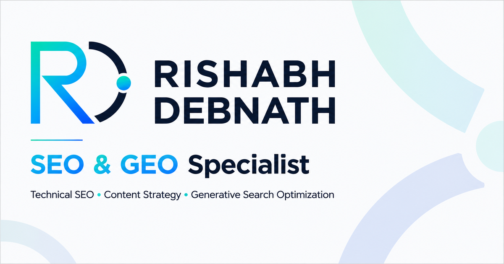
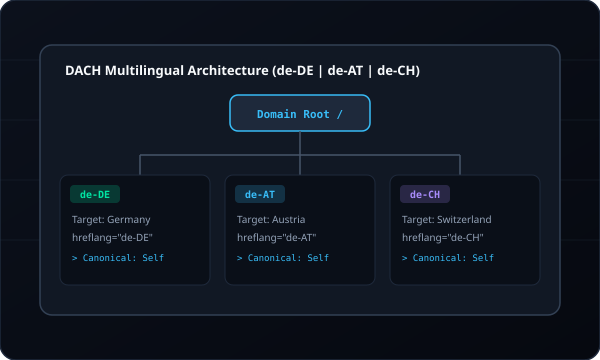
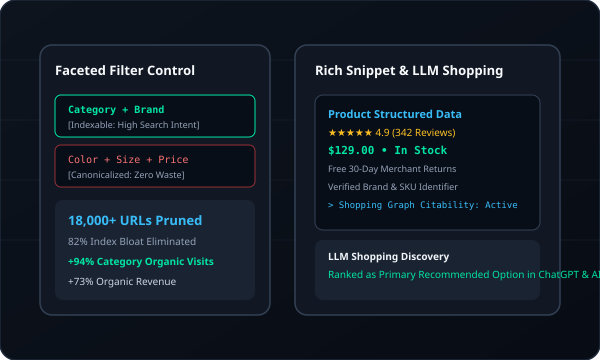
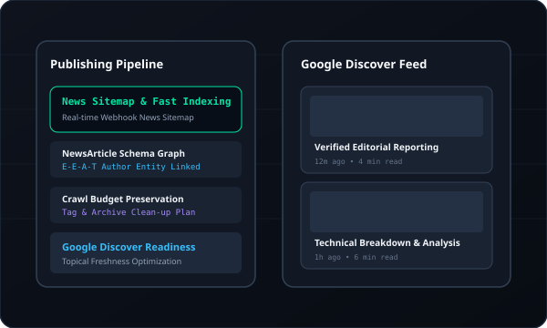

<div align="center">

<!-- Hero Banner -->
<a href="https://rishabhdebnath.com">
  
</a>

<br/><br/>

# Rishabh Debnath
### SEO & Generative Engine Optimization (GEO) Specialist
**Production codebase for [rishabhdebnath.com](https://rishabhdebnath.com)**

<p align="center">
  <a href="https://rishabhdebnath.com"></a>
  <a href="https://rishabhdebnath.com/resume.html"></a>
  <a href="mailto:rishabhdebnath101@gmail.com"></a>
</p>

<!-- Engineering & Performance Badges -->
<p align="center">
  
  
  
  
  
</p>

</div>

---

### 🔍 Architectural Philosophy & Approach

I help modern web applications and enterprise brands achieve superior discoverability across both **traditional search engines (Google, Bing)** and **conversational AI engines (ChatGPT Search, Perplexity, Google AI Overviews)**.

* 🧠 **Entity-First Search Architecture:** Moving beyond keyword density to build connected Schema.org knowledge graphs that AI retrieval engines quote accurately.
* ⚡ **Performance & Crawl Governance:** Minimizing crawl waste through tight canonical architecture, XML feed automation, and high-performance Core Web Vitals (sub-1s LCP, 0 CLS).
* 🧪 **Automated Quality Engineering:** Every page in this repository is programmatically audited for 11-viewport responsiveness and 0 SEO regression before production release.

---

### 🚀 Technical Case Studies & Architecture Blueprints

| Case Study & Target Architecture | Focus Areas & Execution |
| :--- | :--- |
| <a href="https://rishabhdebnath.com/work/german-regional-b2b-seo/"></a> | ### 🏢 [German Regional B2B Website](https://rishabhdebnath.com/work/german-regional-b2b-seo/)<br/>*Multilingual DACH Regional Architecture*<br/><br/>• **Reciprocal Hreflang:** Formulated clean 4-way cross-linking (`de-DE`, `de-AT`, `de-CH`, `x-default`) preventing internal ranking cannibalization.<br/>• **Entity Grounding:** Engineered `ProfessionalService` Schema binding ISO 9001 certifications and regional jurisdictions.<br/><br/>[👉 Read Case Study](https://rishabhdebnath.com/work/german-regional-b2b-seo/) |
| <a href="https://rishabhdebnath.com/work/olympia-local-seo/"></a> | ### 🏋️ [Olympia Local Fitness Studio](https://rishabhdebnath.com/work/olympia-local-seo/)<br/>*Local SEO & AI Discovery Architecture*<br/><br/>• **Local Knowledge Graph:** Implemented `ExerciseGym` JSON-LD with geo-coordinates, verified NAP, and weekly schedules.<br/>• **Conversational Q&A:** Structured conversational FAQ sections optimized for direct citation in Perplexity and ChatGPT Search.<br/><br/>[👉 Read Case Study](https://rishabhdebnath.com/work/olympia-local-seo/) |
| <a href="https://rishabhdebnath.com/work/ecommerce-technical-seo/"></a> | ### 🛍️ [Specialty D2C E-commerce Catalog](https://rishabhdebnath.com/work/ecommerce-technical-seo/)<br/>*Faceted Navigation & Merchant Schema*<br/><br/>• **Crawl Bloat Elimination:** Canonical consolidation rules preserving crawl budget across hundreds of product attribute parameters.<br/>• **Merchant Center Schema:** Complete `Product` + `Offer` + `MerchantReturnPolicy` schema qualifying for Google Rich Badges.<br/><br/>[👉 Read Case Study](https://rishabhdebnath.com/work/ecommerce-technical-seo/) |
| <a href="https://rishabhdebnath.com/work/digital-publishing-seo/"></a> | ### 📰 [Digital Publishing & News Portal](https://rishabhdebnath.com/work/digital-publishing-seo/)<br/>*Crawl Budget & Instant Indexation*<br/><br/>• **Rolling XML News Sitemaps:** Automated 48-hour sitemap feeds with real-time ping webhooks for fast-breaking indexing.<br/>• **Journalist E-E-A-T Schema:** `NewsArticle` graph explicitly connecting verified author entities and news organization IDs.<br/><br/>[👉 Read Case Study](https://rishabhdebnath.com/work/digital-publishing-seo/) |

---

### 🛠️ Technical Stack & Capabilities

<div align="center">

| Search & AI Platforms | Auditing & Performance | Data & Analytics | Architecture & Code |
| :---: | :---: | :---: | :---: |
| **Google Search Console**<br/>**Bing Webmaster**<br/>**Perplexity AI**<br/>**ChatGPT Search**<br/>**IndexNow** | **Screaming Frog SEO**<br/>**PageSpeed Insights**<br/>**GTmetrix**<br/>**Chrome DevTools**<br/>**URL Inspection API** | **Google Analytics 4**<br/>**Semrush Pro**<br/>**Ahrefs**<br/>**Google Trends**<br/>**Keyword Planner** | **Schema.org JSON-LD**<br/>**Semantic HTML5**<br/>**Vanilla CSS Tokens**<br/>**Vanilla JavaScript**<br/>**PowerShell QA** |

</div>

---

### 🧪 Automated QA & Testing Suite

Unlike conventional marketing portfolios, this codebase uses automated testing scripts to ensure zero regression before deployment:

```powershell
# 1. Automated Technical SEO & Schema Verification across all 14 pages
powershell -ExecutionPolicy Bypass -File .\scripts\tech_seo_audit.ps1

# 2. Automated 11-Viewport Responsive Layout & Overflow Audit (320px to 1920px)
powershell -ExecutionPolicy Bypass -File .\scripts\qa_responsive.ps1
```

* ✅ **Canonical Governance:** Asserts absolute self-referencing canonical URLs with trailing slashes.
* ✅ **Heading Hierarchy:** Enforces strict H1 ➔ H2 ➔ H3 hierarchy without skipped levels.
* ✅ **Metadata Hygiene:** Verifies title tag lengths (40–60 chars) and meta descriptions (120–160 chars).
* ✅ **Layout Containment:** Enforces `scrollWidth <= clientWidth` on all viewport breakpoints to eliminate horizontal overflow.

---

### 📜 Verified Certifications

* **HubSpot Academy:** SEO Certification • Digital Marketing • Content Marketing
* **Google:** Google Analytics 4 (GA4) Certification • Google Ads Search
* **Semrush:** Technical SEO • Keyword Research & Competitive Analysis
* **Meta:** Meta Blueprint Digital Marketing Fundamentals

---

<div align="center">

### 📬 Connect With Me

**Open for Full-Time Roles & International SEO / GEO Consulting**

[Website](https://rishabhdebnath.com) • [Interactive CV](https://rishabhdebnath.com/resume.html) • [Email Me](mailto:rishabhdebnath101@gmail.com)

</div>
